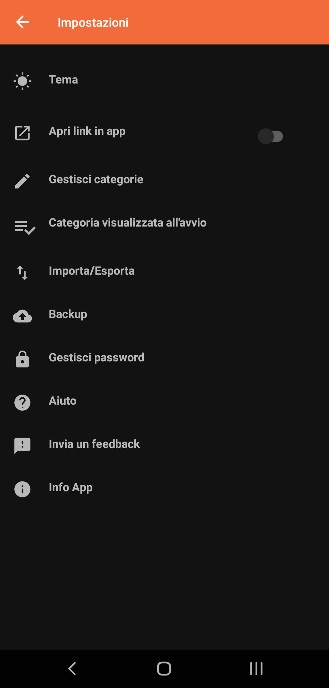
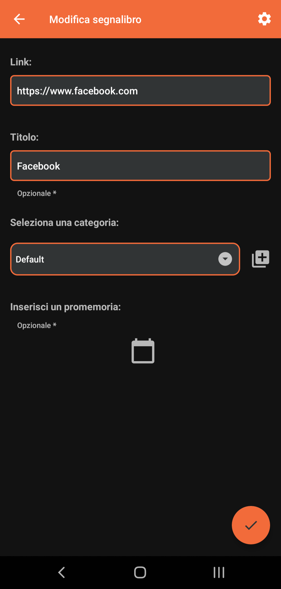

# YABM: Yet Another Bookmark Manager

Yabm is an Android application that allows you to manage your bookmarks through an innovative interface.

## Features
- Add and manage bookmarks
- Grouping bookmarks by category
- Protecting categories with a password
- Importing and exporting bookmarks via any device

## Screenshots
   

## Compiling

This app uses a typical `gradle` folder structure.
 * To build (a debug version): `gradle assembleDebug`.
 
Alternatively, you can import the project into Android Studio and build/run tests from there.

### Reporting Issues

Please report any issues or suggest features on the [issue tracker](https://github.com/lucapetrillo99/yabm/issues).
